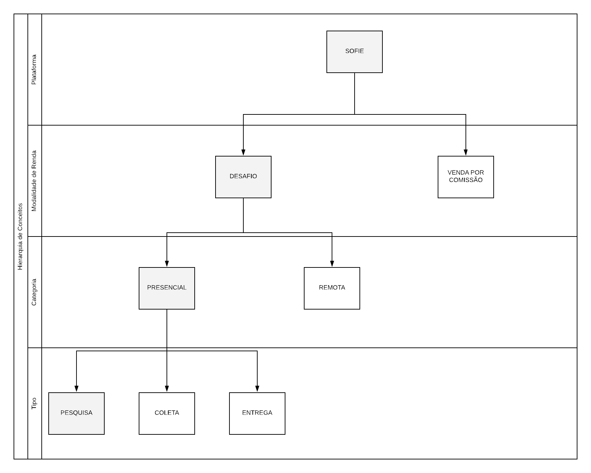

# Propósito da Plataforma

O propósito da plataforma é a de gerar **renda extra** aos seus usuários.  

> _Renda extra é aquele dinheiro que se ganha a mais para não precisar mexer na sua renda ativa, no seu salário._ 
>
> https://www.mongeralaegon.com.br/blog/educacao-financeira/artigo/o-que-e-renda-extra

O usuário tem, então, duas **modalidades** de obtenção de renda com o *Sofie*:

- Micro tarefas - desafios
- Comissão por vendas 

## Micro tarefas - Desafios

Micro tarefas são caracterizadas por *baixa complexidade*.

Na plataforma _Sofie_ as micro tarefas serão referenciadas por **desafios**.

Os desafios são divididos em duas categorias:

- Presenciais
- Remotos

### Desafios presenciais

Os _desafios presenciais_ são caracterizados pela necessidade de se visitar um local para a execução de um tipo de tarefa. Os **tipos** de tarefas são:

- Inspeção
- Pesquisa
- Coleta
- Entrega

#### Desafio presencial de pesquisa

A *pesquisa* é caracterizada pelo preenchimento de um fluxo dinâmico de questionário, podendo haver inclusive envio de fotos.

