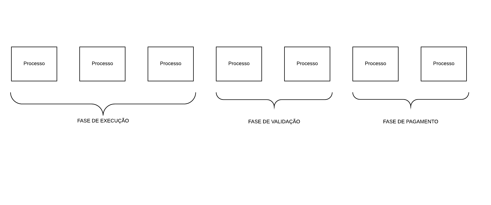

# Livro Caixa

O *sofier* possui <u>quatro</u> contas correntes junto à plataforma, a saber:

- **VALIDATION:** Indica que a tarefa atrelada à movimentação está em processo de *auditoria*
- **BLOCKED:** Indica que a tarefa atrelada à movimentação foi *aprovado* e está na carência
- **AVAILABLE:** Indica que o valor está *disponível* para saque
- **WRONG**: Indica que a execução da tarefa foi *reprovada*

No extrato haverá lançamentos sob o título de **WITHDRAWAL** que se referem aos saques efetuados pelo *sofier*.

Cada <u>tarefa executada</u> tem seu próprio fluxo de validação e pagamento e pontos específicos deste fluxo geram os eventos que debitam e creditam valores em cada uma das contas.



## Axiomas

Quando um *sofier* executa uma tarefa até o fim o prêmio relativo à tarefa é creditado na conta **VALIDATION**.


Quando a execução recebe o evento  **VALIDATED** com o status **OK** ou **NOK** o saldo é debitado da conta **VALIDATION** e creditado na conta **BLOCKED** quando OK ou na conta **WRONG** quando NOK. 


Caso o status seja OK ocorre um agendamento para o valor ficar **AVAILABLE**.


## Estrutura da informação

Os lançamentos serão registrados na tabela `table_sofier_ledger` que possui a seguinte estrutura:

- `sofier` - Partição - ID do *sofier*
- `task_id` - Classificação - ID da tarefa
- `reward` - Valor do prêmio em questão
- `account` - Tipo da conta em que se encontra 
- `history` - Lista com os momentos em que o valor trafegou de conta

```json
{
    "time_stamp": "2019-08-22T16:19:00",
    "account": "VALIDATION"
}
```


